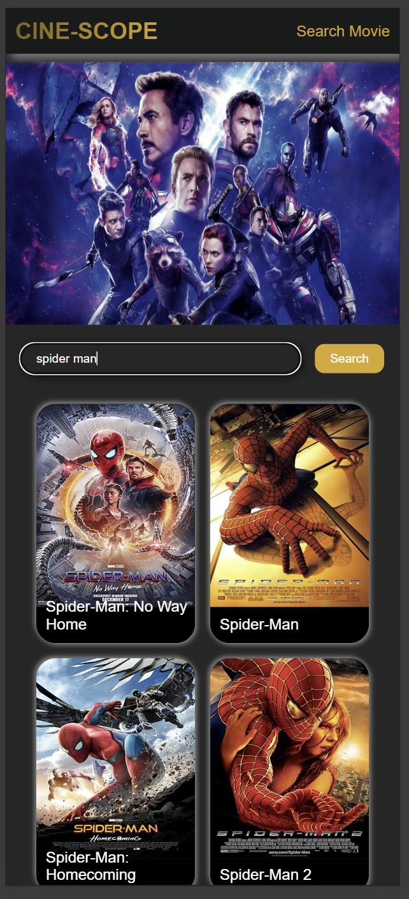
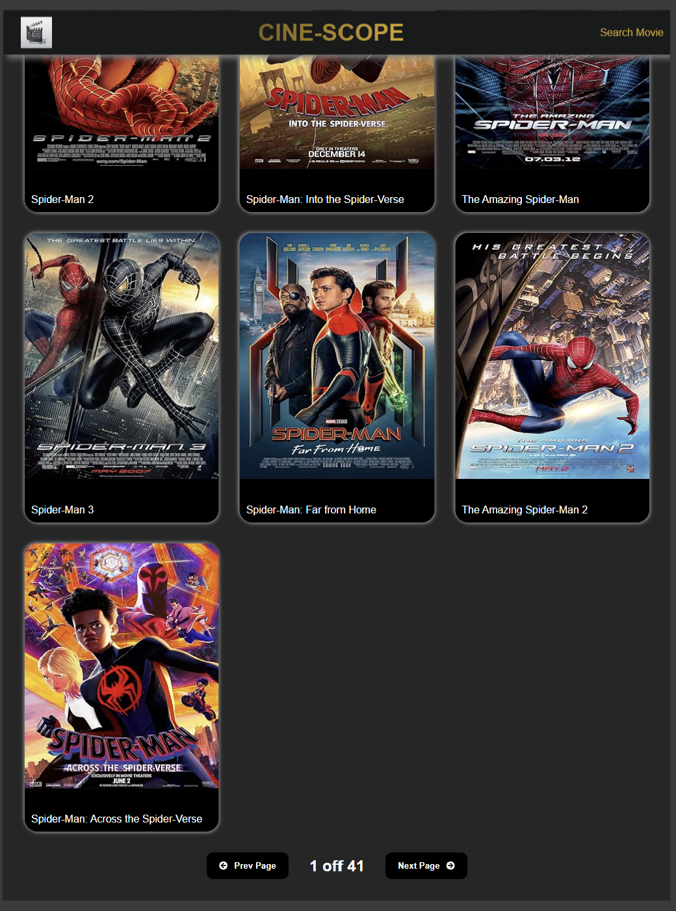
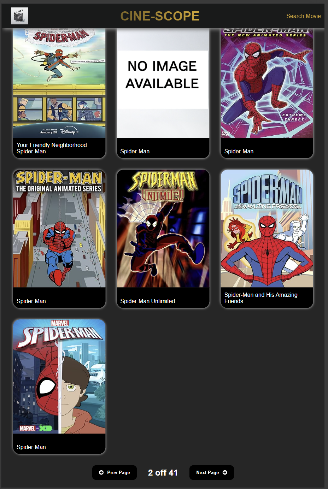

# 🎬 Cine-Scope (Movie Search Web App)

---

## 📖 Overview
- Cine-Scope is a responsive movie search web application built with React.js. It integrates the OMDb API to allow users to explore their favorite movies and shows, providing an intuitive UI across desktop, tablet, and mobile devices.

---

## 🚀 Key Features

🔎 Movie Search – Search for movies and shows using the OMDb API.

📱 Responsive Design – Optimized layouts for web, iPad, and mobile.

🎭 Movie/Show Details – Display posters, titles, and additional info retrieved from the API.

🌐 Social Media Links – Integrated with social icons via react-icons.

⚡ Fast & Lightweight – Built on React with reusable components and clean styling.

---

## 🛠️ Tech Stacks

- Frontend: React.js (JavaScript)

- Styling: CSS (custom .css files)

- Icons: React Icons

- API: OMDb API
 (movie/show data)

- Tooling: Node.js, npm

Languages breakdown:

- JavaScript (~60%)

- CSS (~37%)

- HTML (~3%)

---

## 📸 Screenshots

<figure>
  
  <figcaption><b>Mobile-View</b></figcaption>
</figure>

---

<figure>
  
  <figcaption><b>Ipad-View</b></figcaption>
</figure>

---

<figure>
  
  <figcaption><b>Surface Pro-View</b></figcaption>
</figure>

---

<figure>
  
  <figcaption><b>Web-View</b></figcaption>
</figure>

---

## ⚙️ Installtion and Setup

CREATE YOUR API KEY ON OMDB API (https://www.omdbapi.com/)

```bash

git clone https://github.com/DinethSheveen/Movie-Application-with-React.git

cd cine-scope

echo // config.js > config.js  (export your API_KEY from here )

npm install

npm run dev

```
---